# Lab06

# L.A.

## questions

* WAP to implement a stack which will support three additional operations in addition to push and pop by modifying LA 1.
    - peekLowestElement - return the lowest element in the stack without removing it from the stack
    - peekHighestElement - return the highest element in the stack without removing it from the stack
    - peekMiddleElement - return the (size/2+1)th lowest element in the stack without removing it from the stack.✅
* Write a menu driven program to implement queue operations such as Enqueue, Dequeue, Peek, Display of elements, IsEmpty, IsFull using static array.✅
* Write a menu driven program to implement queue operations such as Enqueue, Dequeue, Peek, Display of elements, IsEmpty using linked list.✅

## O/P

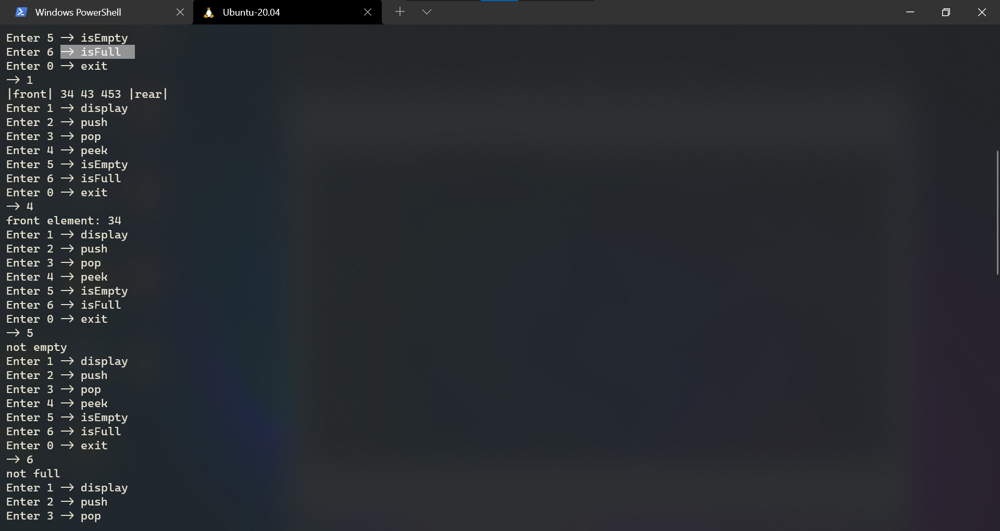
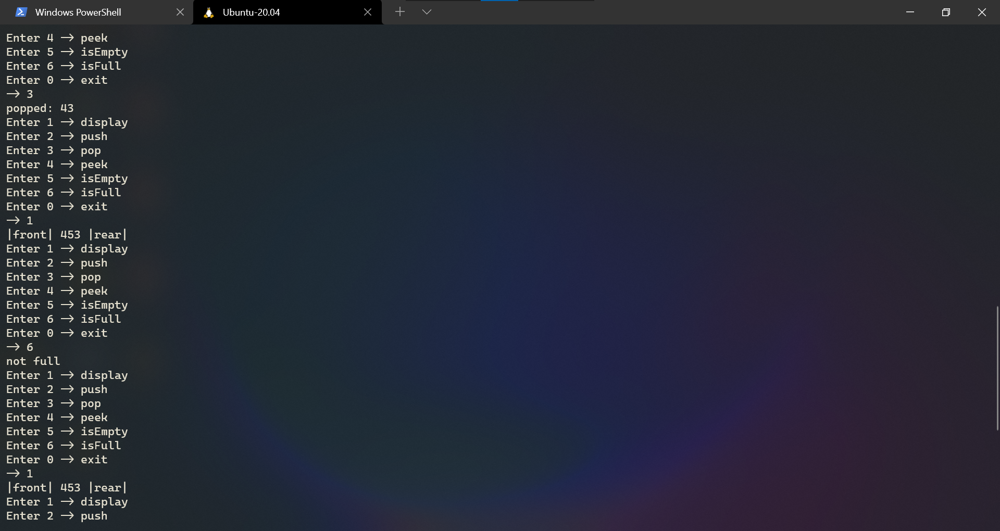

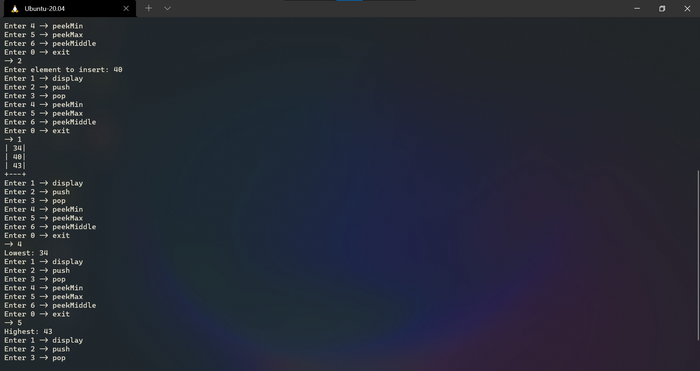
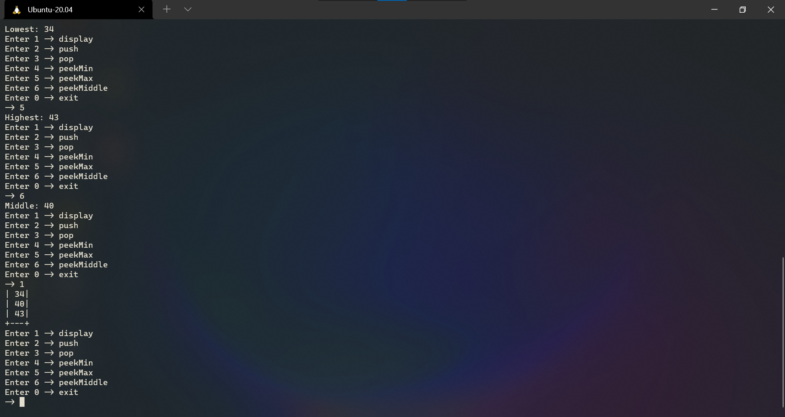

# H.A.

## questions
* Write a menu driven program to implement circular queue operations such as Enqueue, Dequeue, Peek, Display of elements, IsEmpty, IsFull using static array.✅
* Write a menu driven program to implement Deques (both Input-restricted and Output-restricted) operations such as Enqueue, Dequeue, Peek, Display of elements, IsEmpty, IsFull using static array.✅
* Write a menu driven program to implement circular queue operations such as Enqueue, Dequeue, Peek, Display of elements, IsEmpty using linked list.✅

## O/P

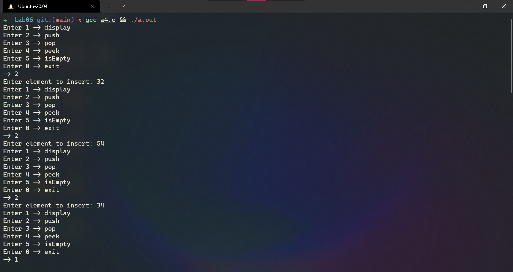
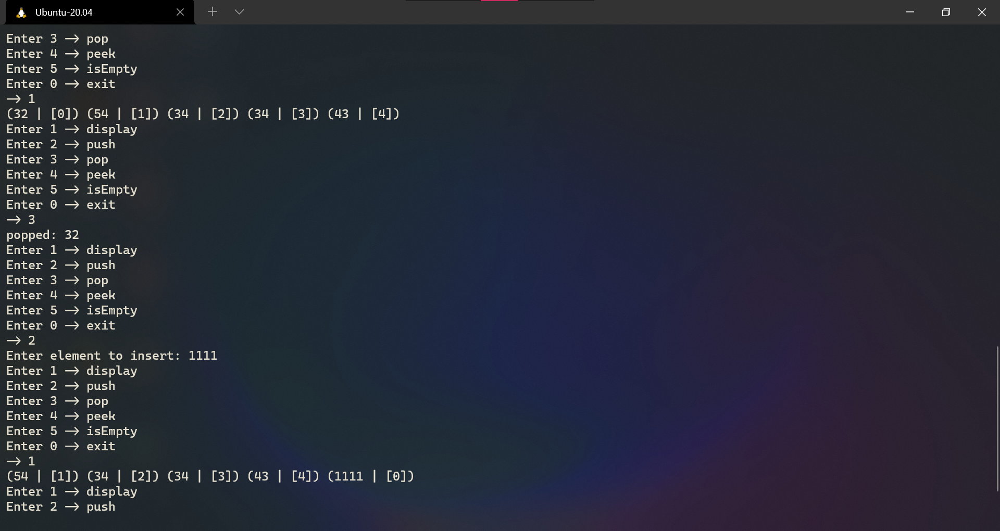
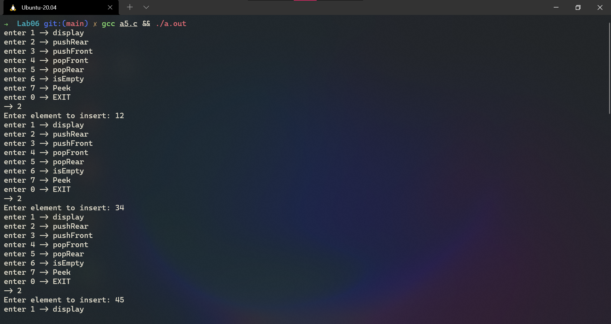
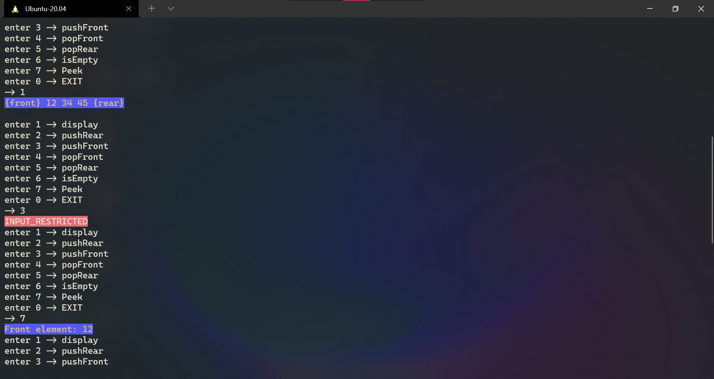
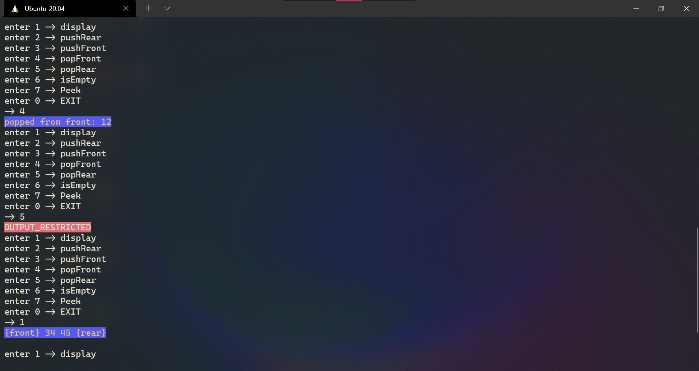
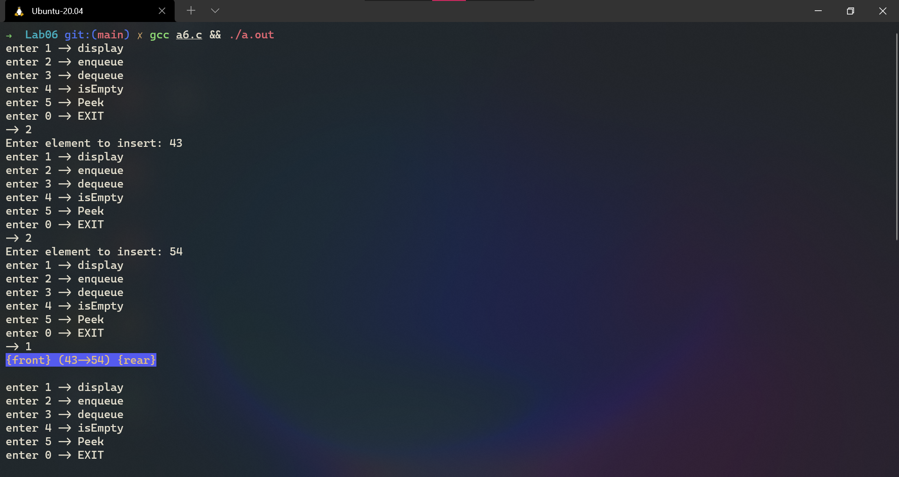
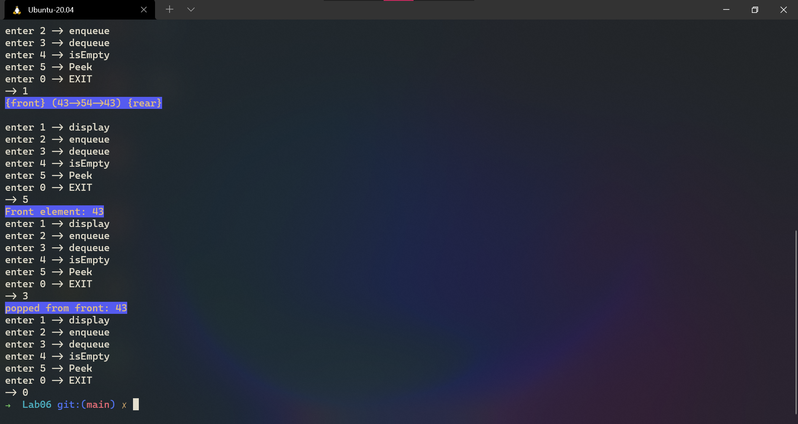

