# Lab09

`Date: 8-11-21`

# questions
1. WAP Write the following menu driven program for the binary search tree
Binary Search Tree Menu
0. Quit
1. Create (Insert a node as per user entered key value.)
2. In-Order Traversal
3. Pre-Order Traversal
4. Post-Order traversal
5. Search an element
6. Find Smallest Element
7. Find Largest Element
8. Deletion of a node as per user entered key value.
9. Deletion of the whole Tree
✅

# o/p
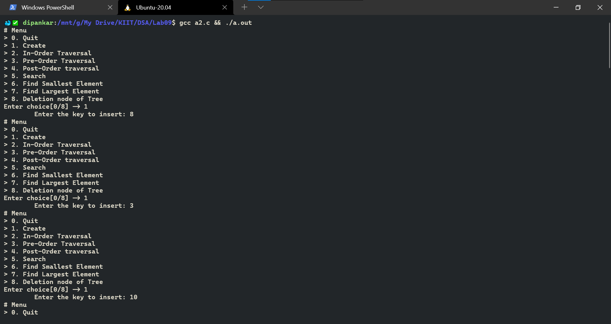
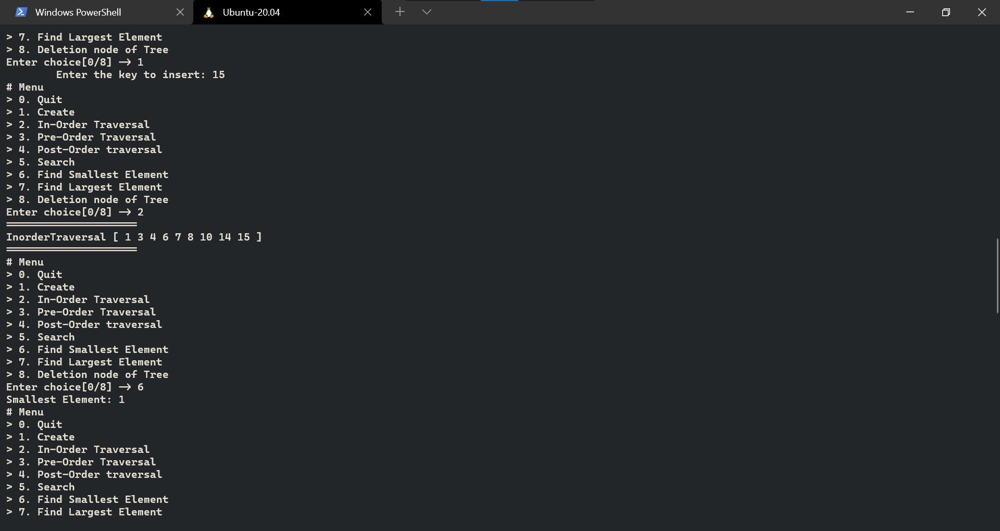
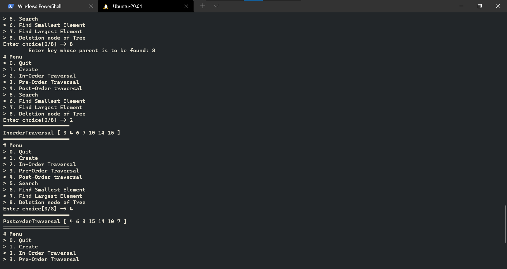
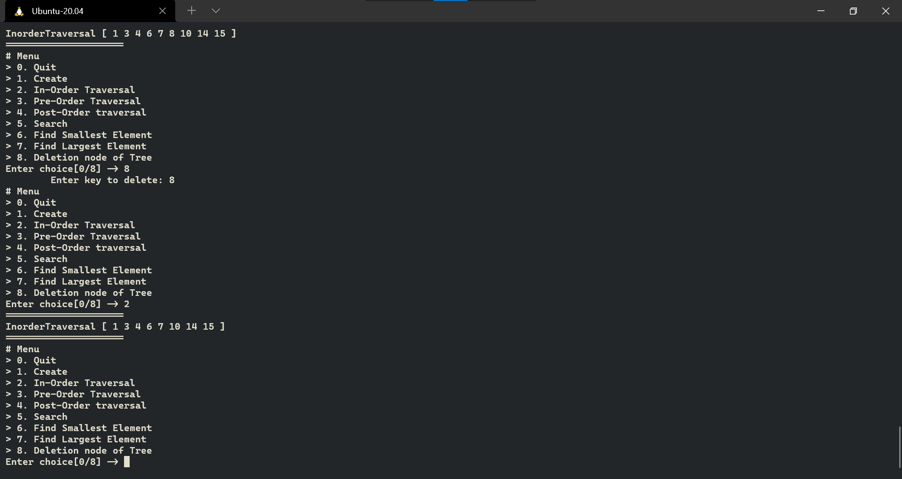
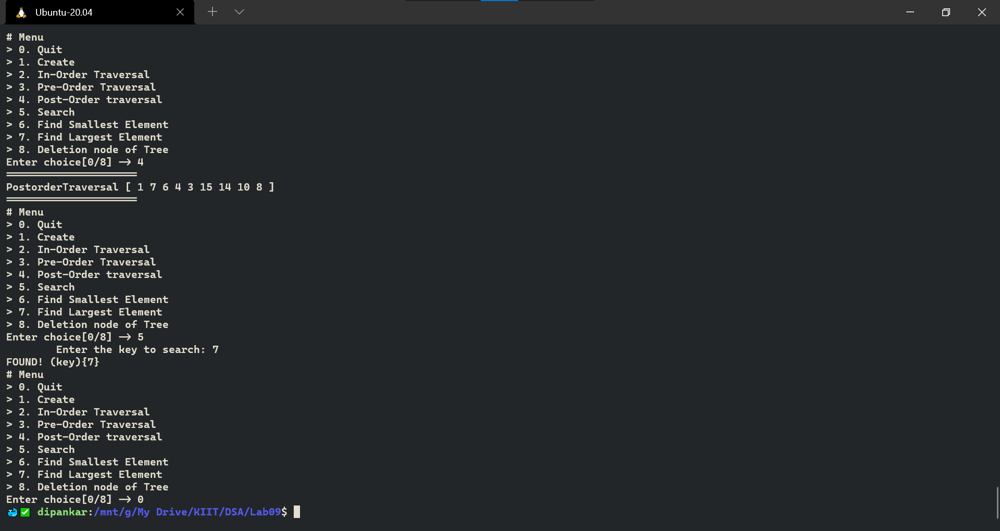

# H.A
1. **(cont)** Extend the LA 1 by providing more options as follows:
a) To count number of leaf nodes in the tree.✅
b) To count number of non-leaf nodes in the tree.✅
c) To find number of nodes in the tree.✅
d) To find sum of all nodes of the tree.✅
e) To print depth of the tree.✅
f) To find nodes which are at maximum depth in the tree?✅
g) To print all the elements of kth level in single line.✅
h) To find the common ancestor and print the paths.✅
i) To check whether a tree is a binary search tree or not.✅

# o/p
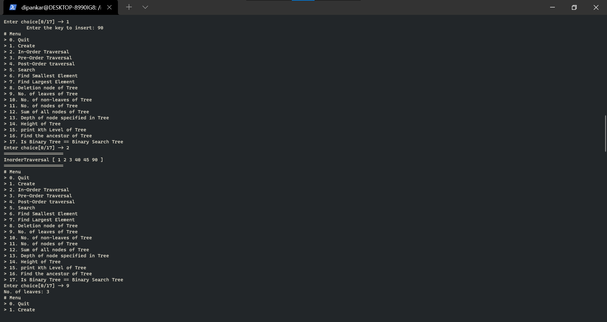
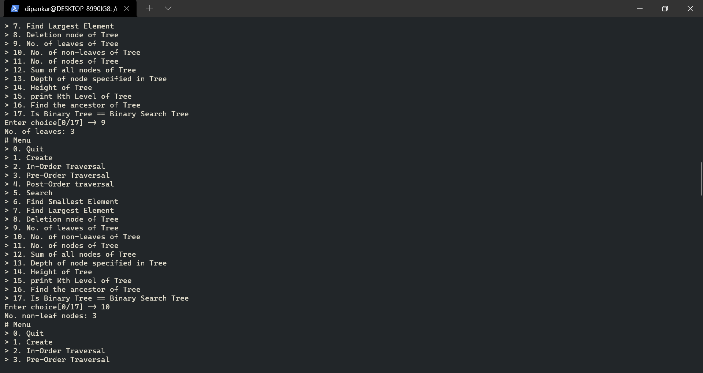
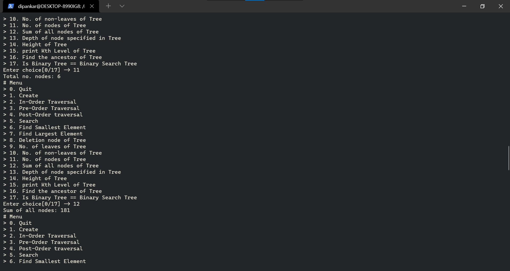
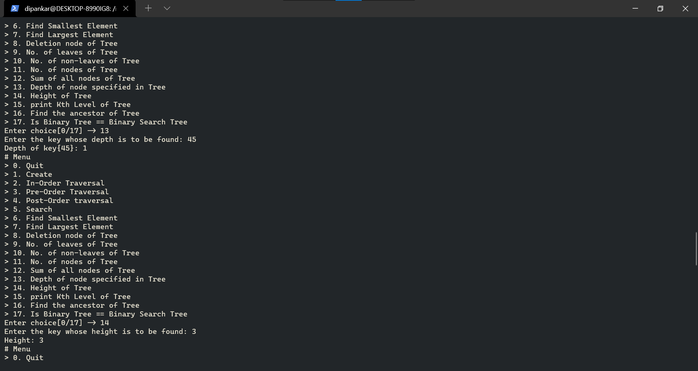
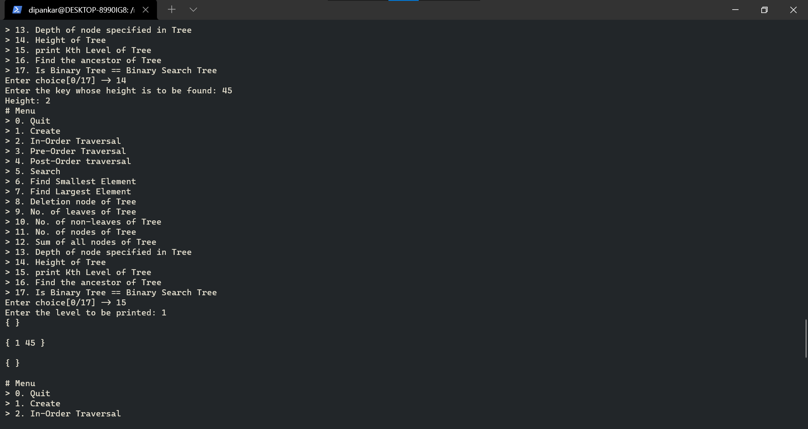
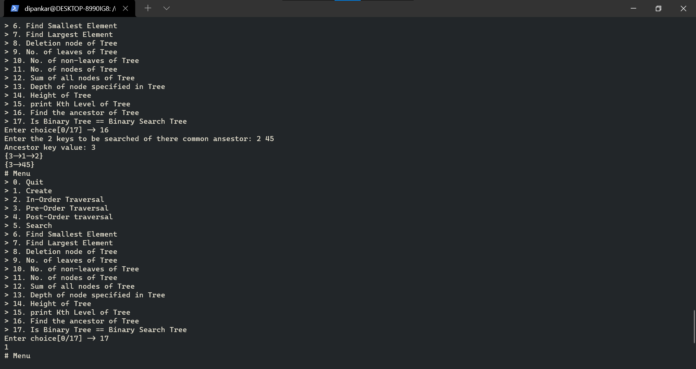
